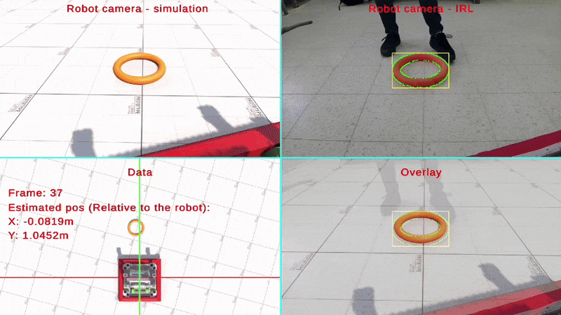

# Game Piece Position Estimation

 


*A fast, robust, and field-ready algorithm for real-time object pose estimation in FRC.*

---
## Documentation
Full setup instructions, Blender configuration, and usage examples are available in the Step-by-Step Guide.

---
## Overview
This project provides a complete, open-source pipeline for estimating the real-world position and orientation of FRC game pieces from camera images. It uses a data-driven image-matching approach, offering extremely fast and accurate pose estimation—optimized for Raspberry Pi deployment in real-world matches.

## Key Features

- **High-Speed & Accuracy**  
  Matches live camera images to a precomputed dataset of rendered frames for sub-10ms pose estimation.
  
- **Fully Explained, Fully Open**  
  Includes all source code, rendering tools, and clear documentation of each stage—perfect for learning, customization, or direct use.

- **Modular, Multi-Process Architecture**  
  Ensures real-time performance by offloading detection, estimation, and networking to separate processes.

- **Built for FRC Robots**  
  Seamless integration with FRC systems via **NetworkTables**, optimized for Raspberry Pi or similar edge devices.

---

## How It Works

### 1. Preprocessing (One-Time, Offline)
- Render thousands of labeled images in **Blender** using the provided scripts.
- Each frame encodes the 3D pose of the game piece from a fixed camera viewpoint.
- Store the dataset in CSV format with pose metadata.

### 2. Runtime (On-Robot)
- Capture live frames from the robot’s fixed-position camera.
- Detect the game piece using either simple color filtering or ML-based segmentation.
- Extract bounding rectangles and (optionally) orientation info.
- Find the closest match in the dataset using a **fast image similarity search**.
- Output the real-world position and orientation of the game piece.

---

## Quick Start

1. **Clone the repository**:
   ```bash
   git clone https://github.com/YoavRozov/FRC-Game-Piece-Pos-Estimation.git
   cd game-piece-pos-estimation
   ```

2. **Install dependencies**:
   ```bash
   pip install -r requirements.txt
   ```

3. **Read the full setup guide**:
  [Here](https://yoavrozov.github.io/FRC-Game-Piece-Pos-Estimation/setup/)

---

## License

This project is licensed under the AGPL-3.0 License. See the LICENSE file for more details.
