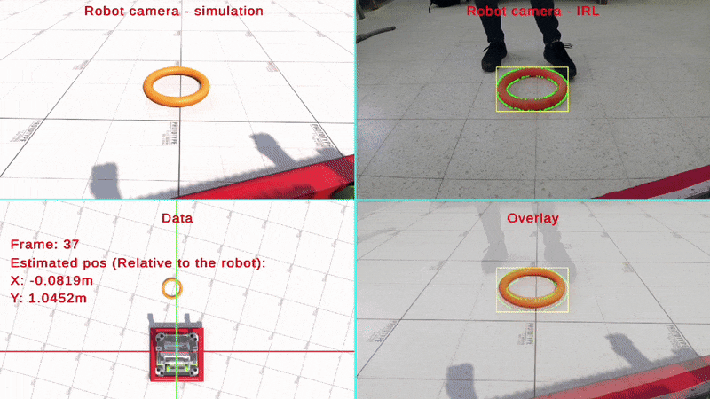

# FRC Game Piece Position Estimation

*A fast, robust, and field-ready algorithm for real-time object pose estimation in FRC.*

---

This project provides a complete, open-source pipeline for estimating the **real-world position and orientation of FRC game pieces** from camera images. It uses a data-driven image-matching approach, offering **extremely fast and accurate pose estimation**—optimized for Raspberry Pi deployment in real-world matches.

The algorithm is designed for fixed-camera setups and leverages a precomputed dataset of synthetic images rendered in Blender. During runtime, it matches live camera frames to this dataset to infer the pose of the game piece in under 10 milliseconds.

---

## Key Features

- **High-Speed & Accuracy**  
  Matches live camera images to a precomputed dataset of rendered frames for sub-10ms pose estimation.

- **Fully Explained, Fully Open**  
  Includes all source code, rendering tools, and clear documentation of each stage—perfect for learning, customization, or direct use.

- **Modular, Multi-Process Architecture**  
  Ensures real-time performance by offloading detection, estimation, and networking to separate processes.

- **Built for FRC Robots**  
  Seamless integration with FRC systems via **NetworkTables**, optimized for Raspberry Pi or similar edge devices.

---

## How It Works

### Preprocessing (One-Time, Offline)

- Render thousands of labeled images in **Blender** using the provided scripts.
- Each frame encodes the 3D pose of the game piece from a fixed camera viewpoint.
- Store the dataset in CSV format with pose metadata.

### Runtime (On-Robot)

- Capture live frames from the robot’s fixed-position camera.
- Detect the game piece using either simple color filtering or ML-based segmentation.
- Extract bounding rectangles and (optionally) orientation info.
- Find the closest match in the dataset using a **fast image similarity search**.
- Output the real-world position and orientation of the game piece.

---

!!! note "Step-by-Step Setup Guide"
    For detailed setup instructions, Blender configuration, and usage examples, see the [Step-by-Step Guide](setup.md).
